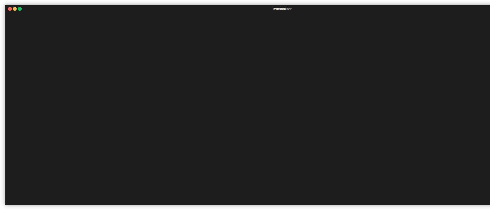

# Elastic Pro Audit Tool

Una herramienta de auditoría y diagnóstico para Elasticsearch a nivel de experto, directamente en tu terminal.

Este proyecto nació de la necesidad de tener una forma rápida y eficiente de diagnosticar problemas en clústeres de Elasticsearch sin tener que navegar por múltiples dashboards o encadenar interminables llamadas a la API. `elastic-pro-audit-tool` centraliza las métricas más críticas en una interfaz de línea de comandos (CLI) interactiva, diseñada para ir directo al grano y encontrar la causa raíz de los problemas.



---

## ✨ Características Principales

El objetivo no es solo mostrar datos, sino darte insights accionables para resolver problemas reales.

* **📈 Dashboard General en Vivo**: Obtén una vista de 360° del estado del clúster, la salud de los nodos agrupados por `tier` y rankings de los índices más activos, todo actualizado en tiempo real.
* **🔀 Análisis de Desbalance de Shards**: Diagnostica "hotspots" de indexación al instante. La herramienta te muestra qué patrones de índice están sobrecargando nodos específicos y lo correlaciona con la **carga de escrituras y búsquedas** para que sepas qué desbalances son realmente críticos.
* **⚡ Análisis de Carga de Nodos**: Entiende *por qué* un nodo está lento. Esta vista correlaciona la CPU y el Heap del nodo con la carga de trabajo (docs/s y req/s) que sus shards están generando.
* **🔬 Diagnóstico Profundo de Nodos**: Sumérgete en los `thread pools` y `circuit breakers` de cada nodo para encontrar cuellos de botella y peticiones rechazadas en el nivel más bajo.
* **📝 Revisión Proactiva de Plantillas**: Analiza tus plantillas de índice en busca de malas prácticas (como un número de shards demasiado alto o la falta de políticas de ciclo de vida) antes de que se conviertan en un problema.
* **🤖 Modo Reporte para Bots**: Genera un resumen conciso del estado del clúster en formato Markdown con el flag `--report`, ideal para automatizar y enviar a canales de Slack o Teams.

---

## 🚀 Puesta en Marcha

### Prerrequisitos

* Python 3.8+
* pip

### Instalación

1.  **Clona el repositorio:**
    ```bash
    git clone [https://github.com/tu_usuario/elastic-pro-audit-tool.git](https://github.com/tu_usuario/elastic-pro-audit-tool.git)
    cd elastic-pro-audit-tool
    ```

2.  **Crea y activa un entorno virtual (recomendado):**
    ```bash
    python -m venv env
    source env/bin/activate  # En Windows: env\Scripts\activate
    ```

3.  **Instala las dependencias:**
    ```bash
    pip install -r requirements.txt
    ```

4.  **Configura tus credenciales:**
    Copia el archivo de ejemplo `.env.example` (si lo tienes) o crea un archivo `.env` en la raíz del proyecto.
    ```bash
    # Ejemplo: cp .env.example .env
    ```
    Luego, edita el archivo `.env` con los datos de tu clúster.

---

## ⚙️ Configuración

La conexión al clúster se define en el archivo `.env`.

```env
# URL base de tu clúster Elasticsearch, incluyendo el puerto.
ES_HOST="[https://tu-cluster.es.us-east-1.aws.found.io:9243](https://tu-cluster.es.us-east-1.aws.found.io:9243)"

# Credenciales de autenticación (si son necesarias).
ES_USER="tu_usuario"
ES_PASS="tu_contraseña_super_secreta"
