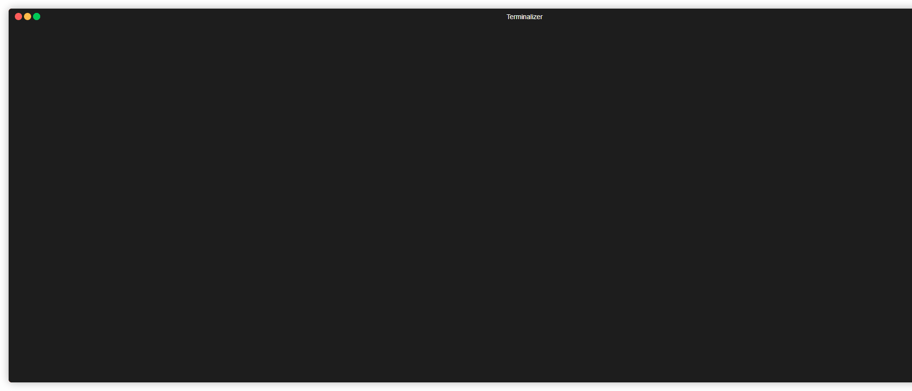

# Elastic Pro Audit Tool

Una herramienta de auditoría y diagnóstico para Elasticsearch a nivel de experto, directamente en tu terminal.

Este proyecto nació de la necesidad de tener una forma rápida y eficiente de diagnosticar problemas en clústeres de Elasticsearch sin tener que navegar por múltiples dashboards o encadenar interminables llamadas a la API. `elastic-pro-audit-tool` centraliza las métricas más críticas en una interfaz de línea de comandos (CLI) interactiva, diseñada para ir directo al grano y encontrar la causa raíz de los problemas.


---

## ✨ Características Principales (Rama `main`)

Esta versión de la herramienta es una aplicación de terminal (TUI) autocontenida que ofrece un menú interactivo con los siguientes análisis:

* **📈 Dashboard General en Vivo**: Una vista de 360° del estado del clúster, la salud de los nodos agrupados por `tier` y rankings de los índices más activos, todo actualizado en tiempo real.

* **🔬 Dashboard de Causa Raíz (Nodos)**: Sumérgete en los `thread pools` y `circuit breakers` de cada nodo en una vista en vivo para encontrar cuellos de botella y peticiones rechazadas en el nivel más bajo.

* **📊 Dashboard de Distribución de Shards**: Analiza de forma interactiva la distribución de shards por patrón de índice o por índice individual, permitiéndote ordenar por tamaño, número de shards o nodos involucrados.

* **🔀 Análisis de Desbalance de Shards**: Diagnostica "hotspots" de indexación al instante. La herramienta te muestra qué patrones de índice están sobrecargando nodos específicos y lo correlaciona con la carga de escrituras y búsquedas para que sepas qué desbalances son realmente críticos.

* **⚡ Análisis de Carga de Nodos por Shards**: Entiende *por qué* un nodo está lento. Esta vista correlaciona la CPU y el Heap del nodo con la carga de trabajo (`docs/s` y `req/s`) que sus shards están generando.

* **⌛ Identificar Tareas de Búsqueda Lentas**: Escanea el clúster en busca de consultas de búsqueda que llevan demasiado tiempo ejecutándose y que podrían estar degradando el rendimiento para otros usuarios.

* **📝 Diagnóstico de Plantillas de Índice**: Revisa proactivamente tus plantillas de índice en busca de malas prácticas (como un número de shards demasiado alto, la falta de políticas de ciclo de vida o patrones de comodín demasiado genéricos) antes de que se conviertan en un problema.

* **💥 Análisis de Explosión de Mapeo**: Evita uno de los problemas más peligrosos en Elasticsearch. Esta función analiza los índices con más documentos para detectar si el número de campos se acerca al límite, lo que podría desestabilizar el clúster.

* **🧹 Detección de Shards Vacíos / Polvo**: Encuentra shards que no contienen documentos o que son extremadamente pequeños ("polvo de shards"). Estos shards consumen memoria y recursos de manera ineficiente y deberían ser eliminados.

* **🕵️ Detección de Deriva de Configuración (Drift)**: Compara la configuración actual del clúster con los valores por defecto esperados e identifica configuraciones "transitorias" que se perderán tras un reinicio, una causa común de problemas inesperados.

* **🔗 Diagnóstico por Cadenas de Causalidad**: Un motor inteligente que intenta encontrar la causa raíz de problemas de memoria. Empieza por nodos con alta presión de memoria (Old Gen) y correlaciona este síntoma con la actividad de GC y la carga de los shards que aloja.

* **☣️ Análisis de Toxicidad de Shards**: Identifica "inquilinos tóxicos". Correlaciona nodos con alta CPU con las consultas lentas que se están ejecutando en ellos e intenta extraer un `tenant_id` o `customer_id` de la consulta para encontrar al culpable.

---


## 🔧 ¿Qué es esta rama?

Esta es la versión **estable y autocontenida** de `Elastic Pro Audit Tool`, pensada para técnicos que desean una herramienta ágil y lista para ejecutarse sin necesidad de servidores externos.

✅ No requiere backend.  
✅ Se ejecuta desde una sola terminal.  
✅ Ideal para exploración y diagnóstico en tiempo real.

---

## 🚀 Características

- **Dashboard general en vivo**: Estado del clúster y nodos.
- **Análisis de shards**: Hotspots, distribución y desbalances.
- **Tareas lentas y plantillas peligrosas**.
- **Detección de toxicidad, deriva de configuración y más**.

---

## ⚙️ Instalación

```bash
git checkout main
git clone https://github.com/iTiagoCO/Elastic-Audit-Tool-Python.git
cd Elastic-Audit-Tool-Python
python -m venv env
source env/bin/activate  # Windows: env\Scripts\activate
pip install -r requirements.txt
```

---

## 🛠️ Uso

Lanza la interfaz TUI:

```bash
python -m src.main
```

Desde aquí puedes navegar entre 12 módulos de análisis.

---

## 🧠 ¿Quieres algo más avanzado?

Consulta la rama [`api-refactor`](https://github.com/iTiagoCO/Elastic-Audit-Tool-Python/tree/api-refactor) para generación de reportes y análisis automatizado con IA.

---
